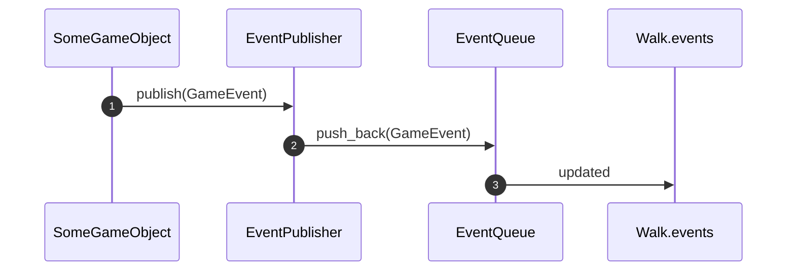
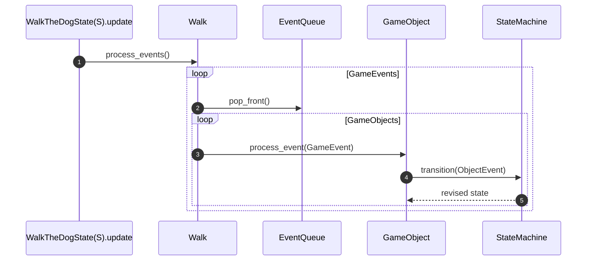

# Game

## Game Events

To try out a different event system following more of a pub sub model or an Event Queue. This is not part of the book tutorial. The motivation was to follow more of a redux-like model and allow some events to be dispatched from deep within a game object update method that are processed a bit later (in the next update loop iteration).

### Event Dispatching

. The game object then uses its `EventPublisher` to

Notes:

1. A game object (e.g. `Dog` or `DogContext`) detects a trigger condition and uses its `EventPublisher` to publish the relevant `GameEvent` (e.g. `GameEvent::DogTooClose`).
2. `EventPublisher` adds it to the back of its internal `events` queue.
3. `Walk` owns the `events` queue that various game objects (e.g. `DogContext`) share (see [EventQueue](#eventqueue))

### Event Processing

Notes:

1. The main `update` loop in `WalkTheDogState(S)` (where S is `Ready`, `Walking`, or `GameOver`) calls `process_events` on `Walk`
2. `Walk` loops through all `GameEvent`s in the queue, popping each one. (As of this writing, this is all `Obstacles` and `Dog`, did not implement for `Boy`.)
3. For each `GameEvent`, `Walk` then sends the `GameEvent` to each game object.
4. Each game object handles `GameEvent`s of interest by calling `transition` on its `StateMachine` with the relevant game object `Event`.
5. The game object then updates its `StateMachine` with the (potentially revised) `StateMachine` returned from the `transition` method.

Note the implication here is that dispatched Events are processed on the subsequent frame. (We could potentially have post-update events and pre-update like these ones)

### EventQueue

[EventQueue](./event_queue.rs) is really a `Rc<RefCell<VecDeque<GameEvent>>>`:

- `GameEvent` is the enum of valid game events
- `VecDequeue` is the underlying data queue structure that allows enqueuing and dequeuing. (Part of std lib)
- `RefCell` allows for interior mutability so multiple objects can borrow the queue and mutate it.
- `Rc` allows multiple objects to hold references to `RefCell`

Put together, this means we have a queue that can be shared among many objects. Game objects can only publish to the `EventQueue` because they get at it only via the `EventPublisher.publish` method. But `Walk` owns the `EventQueue` and can pop items from it.

### Event Subscribers

Subscribing the Dog and Obstacles into a Vec(dyn EventSubscriber) is convoluted because it means we need multiple mutable references to Dog and each Obstacle as dyn EventSubscriber and Obstacle itself is a trait. We want this single vector so we can loop through it in `process_events` and call each subscriber's `process_event` which means each subscriber must be mutable since processing an event should allow the subscriber to change itself.

I hacked my way to a working solution with the help of Chat GPT and its friends, but it is ugly and complicated and I don't fully understand it.

Let's start with `Dog`. `Walk` can no longer fully consume the `Dog` in `new`. Instead, we put in a `RefCell` (to allow for interior/runtime immutability) and put that in `Rc` to allow for multiple references. But we cannot just put that in a `Vec` of `dyn EventSubscribers` because of `Obstacles`.

`Obstacles` have to be put inside a `RefCell` and `Rc` for the same reason as `Dog`. But they have to be put inside a `Box` before going into `RefCell`, since the `Obstacle` trait isn't sized.

The other complexity is that what we want a `Vec` of `EventSubscribers`, so we need to convert the `Dog` and `Obstacles` that are consumed within the `Rc` `RefCell` (and `Box`) to `EventSubscriber`. Rust is not able to just cast these things when wrapped like that. So we create a `Subscriber` wrapper. `Subscriber` is an enum with variants for `Dog` wrapped inside `RefCell` and `Rc` and for `Obstacle` wrapped inside `Box`, `RefCell` and `Rc`. `Subscriber` implements `EventSubscriber` by simply delegating each method to the proper variant. So now, our `event_subscribers` `Vec` can hold `Subscriber` elements, which are sized and also implement `EventSubscriber`.

#### Generating and Dropping Obstacles

I also moved the logic for generating and dropping obstacles from `Walking` into `Walk`. Not only did this make more sense in terms of responsibility, but it also makes it easier to subscribe and unsubscribe them. `generate_next_segment` creates the next segment of obstacles (via `SegmentFactory`) and subscribes them. While `drop_surpassed_obstacles` removes obstacles that have scrolled off the left side of the screen from both the `obstacles` and `event_subscribers` vectors.

#### Resetting

Another bit of weirdness is with `Walk.reset()`, which consumes the active instance of `Walk`. At this point, we want to also reset `Dog`, but `Dog.reset()` consumes the `Dog` instance. So we need to unwrap that out of the `RefCell` and `Rc`, which we cannot do because `event_subscribers` also has a reference to it. So we first need to clear the event subscribers vector so that the reference count will drop to 1.
