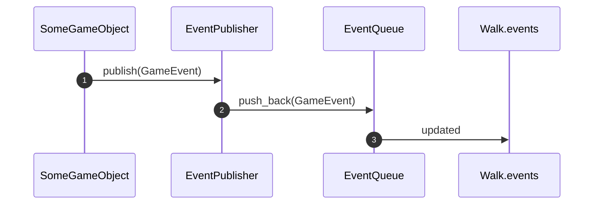
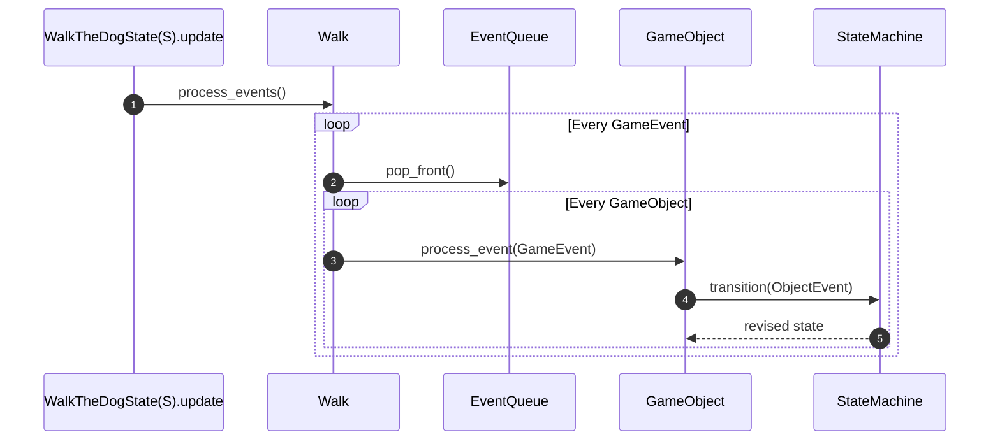

# Game

## Game Events

To try out a different event system following more of a pub sub model or an Event Queue. This is not part of the book tutorial. The motivation was to follow more of a redux-like model and allow some events to be dispatched from deep within a game object update method that are processed a bit later (in the next update loop iteration).

### Event Dispatching

. The game object then uses its `EventPublisher` to

Notes:

1. A game object (e.g. `Dog` or `DogContext`) detects a trigger condition and uses its `EventPublisher` to publish the relevant `GameEvent` (e.g. `GameEvent::DogTooClose`).
2. `EventPublisher` adds it to the back of its internal `events` queue.
3. `Walk` owns the `events` queue that various game objects (e.g. `DogContext`) share (see [EventQueue](#eventqueue))

### Event Processing

Notes:

1. The main `update` loop in `WalkTheDogState(S)` (where S is `Ready`, `Walking`, or `GameOver`) calls `process_events` on `Walk`
2. `Walk` loops through all `GameEvent`s in the queue, popping each one.
3. For each `GameEvent`, `Walk` then sends the `GameEvent` to each game object.
4. Each game object handles `GameEvent`s of interest by calling `transition` on its `StateMachine` with the relevant game object `Event`.
5. The game object then updates its `StateMachine` with the (potentially revised) `StateMachine` returned from the `transition` method.

Note the implication here is that dispatched Events are processed on the subsequent frame. (We could potentially have post-update events and pre-update like these ones)

### EventQueue

[EventQueue](./event_queue.rs) is really a `Rc<RefCell<VecDeque<GameEvent>>>`:

- `GameEvent` is the enum of valid game events
- `VecDequeue` is the underlying data queue structure that allows enqueuing and dequeuing. (Part of std lib)
- `RefCell` allows for interior mutability so multiple objects can borrow the queue and mutate it.
- `Rc` allows multiple objects to hold references to `RefCell`

Put together, this means we have a queue that can be shared among many objects. Game objects can only publish to the `EventQueue` because they get at it only via the `EventPublisher.publish` method. But `Walk` owns the `EventQueue` and can pop items from it.
