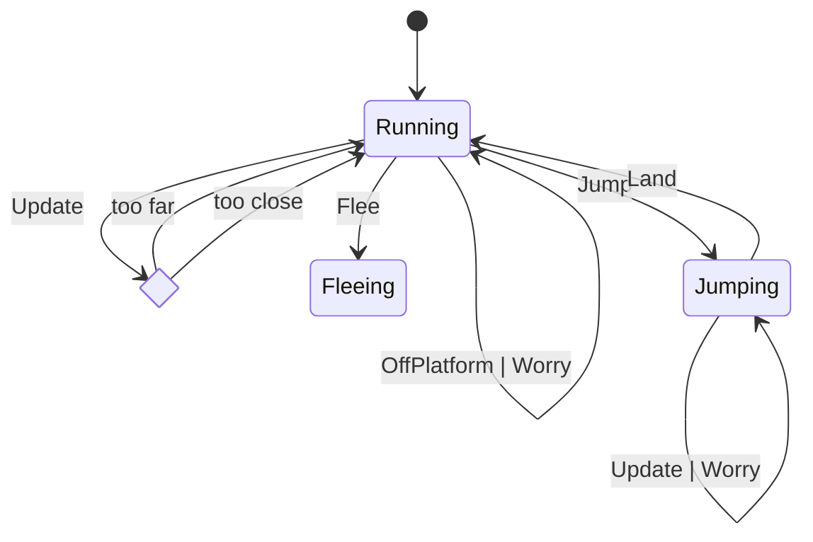
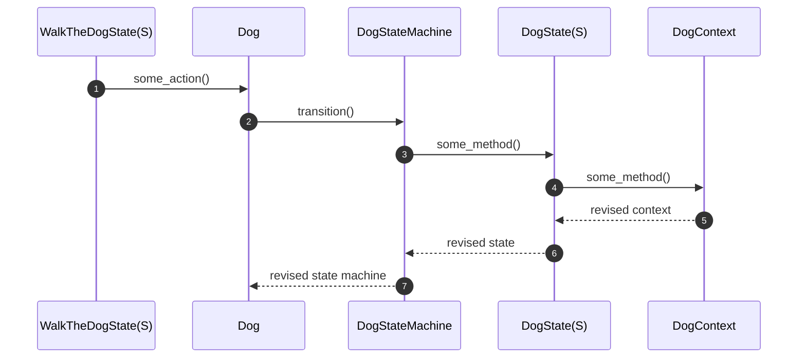

# Dog

The Dog is always running either way or towards the boy. When it gets too far, it reverse direction and runs towards the boy. When too close, it reverses again.

It navigates obstacles by Jumping whenever it hits a mark. Obstacles have an optional "left" or "right" mark that trigger a Jump when intersected by the Dog. The Dog may then Land on either a Platform, or back on the ground. See [Platform Navigation](#platform-navigation).

## State Diagram

## Generic State Transition Sequence

Notes:

1. `WalkTheDogState.update` itself, or via `Obstacle.navigate` or `Obstacle.check_intersection`, calls a method on `Dog` (i.e. flee, jump, on_platform, off_platform, worry, update)
2. `DogStateMachine.transition` is called with a relevant Dog Event (i.e. `Flee`, `Jump`, `Land`, `OffPlatform`, `Update`, `Worry`)
3. Relevant method is called on `DogState(S)`, where `S` is `Running` or `Jumping`.
4. `DogContext` is revised
5. Revised context is typically replaced in `DogState`
6. The same or a new `DogState` (with revised context) is returned in a new `DogStateMachine` variant instance
7. `Dog.state_machine` is replaced with new `DogStateMachine` instance

### Update

- `WalkTheDogStateMachine` is an enum with 3 variants of `WalkTheDogState`:
  - `Ready` when the game is waiting to start. Here the background is not scrolling and so the Dog has vx of 4 or -4. It initially runs away and then returns when it gets too far.
  - `Walking` during game play. Here the background is scrolling left so both the Boy and the Dog have a vx of 0. The Dog always runs to the right in this game state.
  - `GameOver`. Here the background is once again still and the Dog's vx toggles between 4 and -4.
- `WalkTheDogStateMachine.update` is called on every frame. It, in turn,
  - calls `update` on the Boy and the Dog
  - calls `Obstacle.navigate` on every Obstacle, which makes the Dog navigate the Platform or Barrier (stone) Obstacles.
  - calls `Obstacle.check_intersection` on every Obstacle to check if the Boy hit anything when moving, in which case it calls `Dog.worry`.
- `Dog.update` -> `DogStateMachine(S).update`
- `DogContext.update`
  - Increases vy unless the Dog has reached `TERMINAL_VELOCITY`
  - Increments the animation frame
  - Updates the x,y position based on vx and vy, ensuring y is > floor
  - Toggles direction if the Dog is on the floor (Ground or platform) and it has run too far from or too close to the Boy.
- `DogState(Jumping).update` transitions to `Running` if the Dog is falling (vx > 0) and is already on the floor (Ground or Platform).

### Flee

Conditions:

- Game is in `Ready` state
- `ArrowRight` pressed (detected in `WalkTheDogState(Ready).update`)

Sequence: `dog.flee()` -> `DogStateMachine.transition(Event::Flee)` -> `DogState<S>.flee()` -> `DogContext.flee()`:

- Set vx to 0 to account for the fact that the background will start moving left. If the Dog has run too far from the Boy, vx is set to -1, which will allow the Boy to catch up with the Dog, at which point the Dog will reverse direction and run away.
- The top `update` method also transitions game to `WalkTheDogState(Walking)`

### Jump

Conditions:

- `Obstacle.navigate` (Obstacle is either `Barrier` (stone) or `Platform`) detects the Dog has hit either the left mark when moving right or the right mark when moving left

Sequence: `dog.jump()` -> `DogStateMachine(S).transition(Event::Jump)`:

- set `vy` to `JUMP_SPEED`
- transition to `Jumping`
- The `jump` command is ignored if `vy` < 0 (meaning Dog is on the upward arc of a Jump). This can easily happen since the mark is hit repeatedly.

### Land

Conditions:

- `Platform.navigate` -> detects dog is hitting the Platform (should always be when falling on it during the downward arc of a Jump).
- `DogContext.floor` is `DOG_GROUND`

Sequence: `dog.on_platform()` -> `DogStateMachine.transition(Event::Land(platform top)` -> `DogState(Jumping).land_on` -> `DogContext.set_floor(platform top)`:

- transition to `Running`
- Error (bug) if `Land` triggered when NOT (jumping and falling)
- set `Platform.has_dog` to true, so we can trigger `OffPlatform` later

Note: landing on the floor is not a formal event. It is detected in `DogState(Jumping).update` and also results in transitioning to `Running`.

### OffPlatform

Conditions:

- `Platform.navigate` detects when not on a mark or dog intersecting with platform BUT previously dog was on the platform (i.e. `has_dog` is `true`):

Sequence: `dog.off_platform()` -> `DogStateMachine.transition(Event::OffPlatform)` -> `DogState(Running).drop_from_platform()` -> `DogContext.set_floor(GROUND)`

- Set `Platform.has_dog` to `false`
- Error if `OffPlatform` event in `Jumping` state

### Worry

Conditions: `Obstacle.check_intersection` detects `Boy` has hit the `Obstacle`
Sequence: `dog.worry()` -> `DogStateMachine.transition(Event::Worry)` -> `DogState(S).worry()` -> `DogContext.worry()`

- set `vx` to 4 (since background has stopped scrolling) so Dog keeps moving away from Boy
- set `distance_min` to 50 so Dog can get very close to `Boy`

## Platform Navigation

A segment with a platform onto which a Dog must jump has a mark set on either side of the platform. The mark may be on the Platform object itself (or, if a Barrier immediately precedes a Platform, on a Barrier). The mark (left or right) is an indicator that the Dog should Jump. Hence, both a Barrier and Platform Obstacle has logic that fires the Dog Event::Jump when the Dog hits a mark.

The Platform Obstacle also checks if the Dog hits the platform itself, which we assume must mean the Dog was on the descending cycle of a jump and has landed on the platform (since a Dog should never otherwise hit the platform). The Platform then:

- sets its `has_dog` flag
- notifies the Dog via `dog.on_platform`
- which in turn fires `Dog Event::Land`
- which calls `state.land_on`
  - which calls `context.set_floor`
    - which stores the floor value
      At this point, every context update will check to ensure the Dog does not drop below the Platform floor.
  - and returns `DogState(Running)` (or similar)

## Sprites

- From [bevouliin.com](https://bevouliin.com/dog-game-character-sprites/)
- Used TexturePacker to generate sprite sheet PNG and JSON. Sprites scaled down to 40%.
