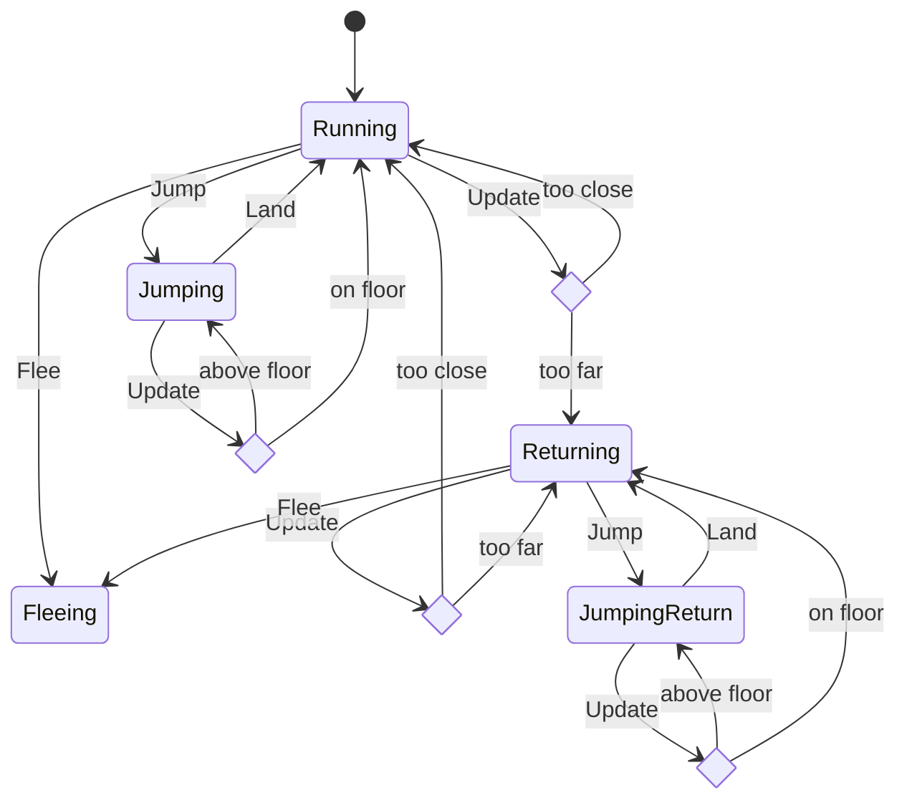
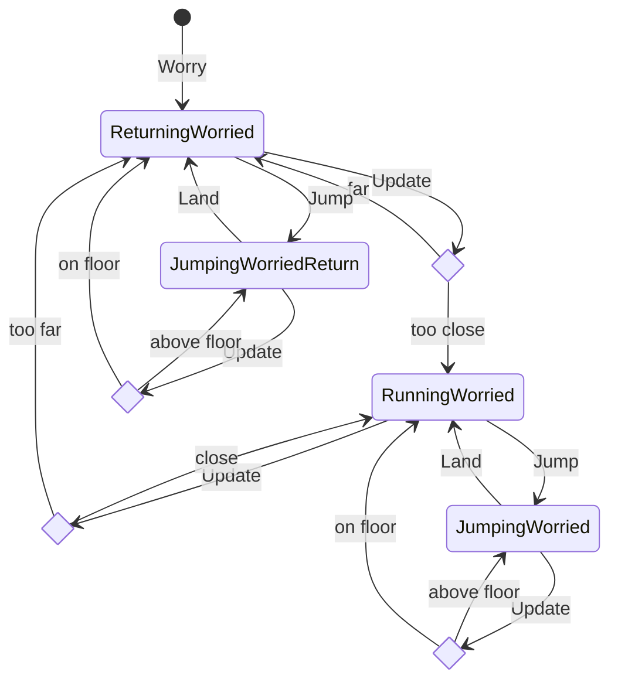

# Dog

## GameState(Ready)

- Game listens for right arrow key
- `BoyState(Idle)`. Boy is idling at left of screen
- `DogState(Running)`. Dog is running away from boy

Game Event: On arrow right, `WalkTheDogState(Ready)` calls:

- boy::run_right() => `Boy Event::Run` => `Boy(Running)`
- dog::flee() => `Dog Event::Flee`

### DogState(Running):

- On `Dog Event::Update` and dog has run too far off screen => Transitions to `Dog(Returning)`
- On `Dog Event::Flee`:

  - if dog is off screen => Transition to `DogState(ReturningToFlee)`
  - if dog is on screen => Transition to `DogState(Fleeing)`

### DogState(Returning)

- On `Dog Event::Update` and dog has approached too close to boy => Transition to `DogState(Running)`
- On `Dog Event::Flee` > Transition to `DogState(Fleeing)`

## GameState(Walking)

- `BoyState(Running)`. Boy is chasing Dog. If Dog is initially off screen, it returns on screen and then flees. Otherwise, it flees.
- if Boy transitions to `BoyState(KnockedOut)`, `GameState(Walking)` detects that and => Transitions to:
  - `GameState(GameOver)`
  - `BoyState(KnockedOut)` (already in this state)
  - Dispatches `Dog Event::Worry`

### DogState(ReturningToFlee)

- On `Dog Event::Update` and dog has approached too close to boy => Transition to `DogState(Fleeing)`
- On `Dog Event::Worry` => Transition to `DogState(ReturningWorried)`

### DogState(Fleeing)

- Dog is fleeing from boy at the same speed as boy and so always on screen

- On `Dog Event::Worry` => Transition to `DogState(RunningWorried)`

## GameState(GameOver)

- `BoyState(KnockedOut)`
- `DogState(RunningWorried | ReturningWorried)`. Dog loops between running away and returning

### DogState(ReturningWorried)

- Dog returns to boy

- On `Dog Event::Update` and dog has approached too close to boy => Transition to `DogState(RunningWorried)`

### DogState(RunningWorried)

- Dog worriedly runs away from boy

- On `Dog Event::Update` and dog has gone too far => Transition to `DogState(ReturningWorried)`
