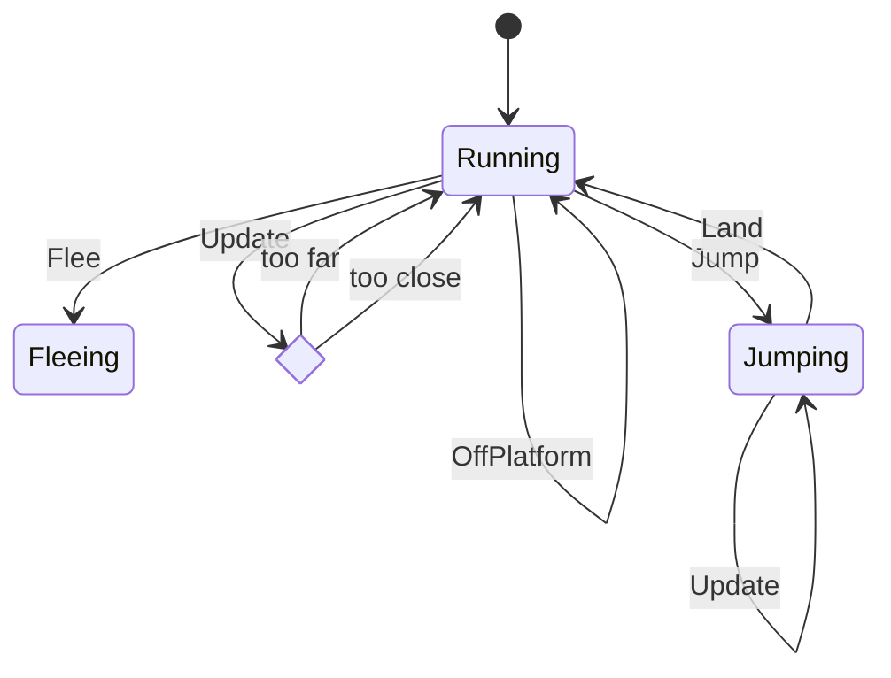
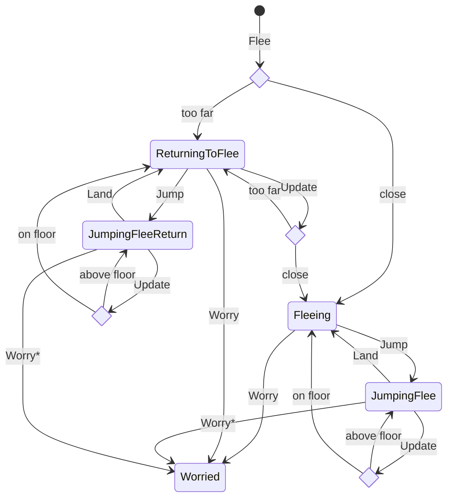

# Dog

## GameState(Ready)

Before the game starts, the Dog is running away from the Boy, but returning if
it goes too far. It jumps over any obstacles. When the game starts, the Dog
transitions to Fleeing and the game is in Walking state (see below).

### DogState(Running):

- `Dog Event::Flee` happens when the game starts.
- `Dog Event::Jump` happens when Dog hits an obstacle "left" mark.
- `Dog Event::OffPlatform` happens when dog is runs off a platform. See [Platform Navigation](#platform-navigation)
- On `Dog Event::Update` and dog has run too far off screen => Transitions to `Dog(Returning)`

  - if dog is off screen => Transition to `DogState(ReturningToFlee)`
  - if dog is on screen => Transition to `DogState(Fleeing)`

### DogState(Returning)

- On `Dog Event::Update` and dog has approached too close to boy => Transition to `DogState(Running)`
- On `Dog Event::Flee` > Transition to `DogState(Fleeing)`

## GameState(Walking)

- `BoyState(Running)`. Boy is chasing Dog. If Dog is initially off screen, it returns on screen and then flees. Otherwise, it flees.
- if Boy transitions to `BoyState(KnockedOut)`, `GameState(Walking)` detects that and => Transitions to:
  - `GameState(GameOver)`
  - `BoyState(KnockedOut)` (already in this state)
  - Dispatches `Dog Event::Worry`

### DogState(ReturningToFlee)

- On `Dog Event::Update` and dog has approached too close to boy => Transition to `DogState(Fleeing)`
- On `Dog Event::Worry` => Transition to `DogState(ReturningWorried)`

### DogState(Fleeing)

- Dog is fleeing from boy at the same speed as boy and so always on screen

- On `Dog Event::Worry` => Transition to `DogState(RunningWorried)`

## GameState(GameOver)

- `BoyState(KnockedOut)`
- `DogState(RunningWorried | ReturningWorried)`. Dog loops between running away and returning

### DogState(ReturningWorried)

- Dog returns to boy

- On `Dog Event::Update` and dog has approached too close to boy => Transition to `DogState(RunningWorried)`

### DogState(RunningWorried)

- Dog worriedly runs away from boy

- On `Dog Event::Update` and dog has gone too far => Transition to `DogState(ReturningWorried)`

## Platform Navigation

A segment with a platform onto which a Dog must jump has a mark set on either side of the platform. The mark may be on the Platform object itself (or, if a Barrier immediately precedes a Platform, on a Barrier). The mark (left or right) is an indicator that the Dog should Jump. Hence, both a Barrier and Platform Obstacle has logic that fires the Dog Event::Jump when the Dog hits a mark.

The Platform Obstacle also checks if the Dog hits the platform itself, which we assume must mean the Dog was on the descending cycle of a jump and has landed on the platform (since a Dog should never otherwise hit the platform). The Platform then:

- sets its `has_dog` flag
- notifies the Dog via `dog.on_platform`
- which in turn fires `Dog Event::Land`
- which calls `state.land_on`
  - which calls `context.set_floor`
    - which stores the floor value
      At this point, every context update will check to ensure the Dog does not drop below the Platform floor.
  - and returns `DogState(Running)` (or similar)
