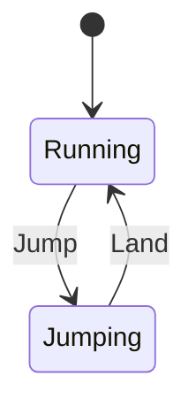
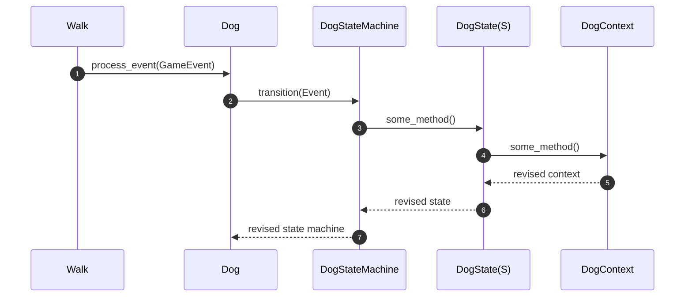

# Dog

The `Dog` is always running either away or towards the boy. When it gets too far, it reverse direction and runs towards the `Boy`. When too close, it reverses again.

It navigates obstacles by `Jumping` whenever it hits (intersects with) a (jump) mark [ObstacleMark](../obstacles/obstacle_mark.rs). The Dog may then `Land` on either a `Platform`, or back on the ground. See [Platform Navigation](#obstacle-navigation).

## State Diagram

## Game Events Relevant to Dog

### BoyHitsObstacle

- Trigger: `Boy` intersects with `Obstacle` (See [Barrier.check_intersection](../obstacles/barrier.rs) and [Platform.check_intersection](../obstacles/platform.rs))
- Dog Command: Event::Worry

### DogExitsPlatform

- Trigger: `Dog` was runs off the platform. (See [Platform.navigate](../obstacles/platform.rs))
- Dog Command: Event::OffPlatform

### DogHitMark

- Trigger: `Dog` (not already on mark) intersects with jump mark. (See [ObstacleMark.navigate](../obstacles/obstacle_mark.rs))
- Dog Command: Event::Jump

### DogOffMark

- Trigger: `Dog` already on mark and no longer intersecting with it. (See [ObstacleMark.navigate](../obstacles/obstacle_mark.rs))
- Dog Command: N/A (unsets flag in `ObstacleMark`)

### DogLanded

- Trigger: `Dog` is not on floor and moves onto it. (See [DogContext.update](context.rs))
- Dog Command: Event::LandOnGround

### DogLandedOnPlatform

- Trigger: `Dog` is not on platform and intersects with it. (See [Platform.navigate](../obstacles/platform.rs))
- Dog Command: Event::LandOn

### DogTooClose

- Trigger: `Dog` is moving left and gets too close to `Boy`. (See [DogContext.update](context.rs))
- Dog Command: Event::TurnAround

### DogTooFar

- Trigger: `Dog` is moving right and gets too far from `Boy`. (See [DogContext.update](context.rs))
- Dog Command: Event::TurnAround

### GameStarted

- Trigger: User presses "ArrowRight". (See [WalkTheDogState(Ready).update](../game_states/ready.rs))
- Dog Command: Event::Flee

### Sequence Diagram

See [Game Events](../README.md#game-events) for the sequence diagrams for event publishing and processing. Below is how [Dog](../dog.rs) processes [GameEvent](../event_queue.rs) when its `process_event(GameEvent)` method is called.

Notes:

1. `Walk` loops through pending `GameEvent`s (e.g. `GameEvent::DogTooFar`) and send each to `Dog` via `Dog.process_event`. (Not shown: `Walk` also calls process_event on each `Obstacle`.)
2. `DogStateMachine.transition` is called with a relevant `Dog` `Event` (e.g. `TurnAround`)
3. Relevant method is called on `DogState(S)`, where `S` is `Running` or `Jumping`.
4. `DogContext` is revised
5. Revised context is typically replaced in `DogState`
6. The same or a new `DogState` (with revised context) is returned in a new `DogStateMachine` variant instance
7. `Dog.state_machine` is replaced with new `DogStateMachine` instance

### Game Loop Update

- `WalkTheDogStateMachine` is an enum with 3 variants of `WalkTheDogState`:
  - `Ready` when the game is waiting to start. Here the background is not scrolling and so the Dog has vx of 4 or -4. It initially runs away and then returns when it gets too far.
  - `Walking` during game play. Here the background is scrolling left so both the Boy and the Dog have a vx of 0. The Dog always runs to the right in this game state.
  - `GameOver`. Here the background is once again still and the Dog's vx toggles between 4 and -4.
- `WalkTheDogStateMachine.update` is called on every frame. It, in turn,
  - calls `update` on the Boy and the Dog
  - calls `Obstacle.navigate` on every Obstacle, which helps the Dog navigate the Platform or Barrier (stone) Obstacles.
  - calls `Obstacle.check_intersection` on every Obstacle to check if the Boy hit anything when moving, in which case it publishes `GameEvent::BoyHitsObstacle`.
- `Dog.update` -> `DogStateMachine(S).update`
- `DogContext.update`
  - Increments the animation frame
  - Increases vy unless the Dog has reached `TERMINAL_VELOCITY`
  - Updates the x,y position based on vx and vy, ensuring y is > floor
  - Publishes `GameEvent::DogLanded` if it detects `Dog` just landed on the floor or `GameEvent::DogTooClose` or `GameEvent::DogTooFar` if the `Dog` has ventured to close/far from `Boy`.

## Obstacle Navigation

A `Segment` with a `Platform` onto which a `Dog` must jump, or a `Barrier` to jump over, has an [ObstacleMark](../obstacles/obstacle_mark.rs) set on either side of the `Obstacle`. `ObstacleMark` is a special `Obstacle` with which only the `Dog` interacts, at which point it publishes `GameEvent::HitMark`. `ObstacleMark` keeps a flag so as to ignore consecutive intersections. When the `Dog` moves past the mark, `ObstacleMark` publishes `GameEvent::OffMark` to unset the internal flag.

The `Platform` `Obstacle` checks if the `Dog` is intersecting it. When it first intersects (presumably on the downward arc of a Jump), it publishes `GameEvent::DogLandedOnPlatform`. If the `Dog` is already on the platform and is detected to no longer intersect with it, `Platform.navigate` publishes `GameEvent::DogExitsPlatform`. The Platform processes these `GameEvents` to set its internal `has_dog` flag to true/false so to avoid republishing the events on consecutive intersections.

## Sprites

- From [bevouliin.com](https://bevouliin.com/dog-game-character-sprites/)
- Used TexturePacker to generate sprite sheet PNG and JSON. Sprites scaled down to 40%.

Note that the sprites for `Jumping` and `Running` all face towards the right, so we flip them horizontally when the Dog is moving left.
